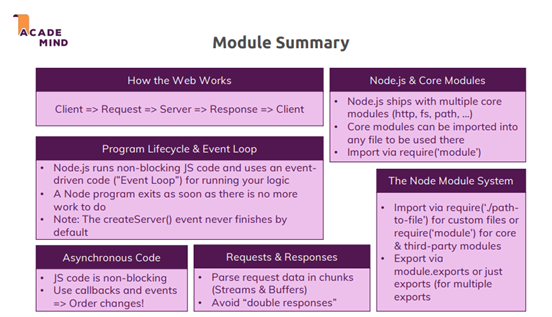

# 💬 Understanding the Basics

## 1. How the Web Works

### Overview

- **Client-Server Interaction**: The user (client) accesses a website via a browser by entering a URL. The browser sends a request to the DNS to resolve the domain to an IP address, then forwards the request to the server.
- **Node.js Role**:
  - Processes incoming requests.
  - Validates and authenticates data for security.
  - Communicates with the database.
  - Sends responses back to the client (HTML, JSON, files).

<p align="center">
  
</p>

### Request/Response Structure

- Requests and responses include headers containing metadata (type, length, encoding).
- Data is transmitted over **HTTP** or **HTTPS** (which uses **SSL/TLS** encryption).

---

## 2. Understanding basic of Node.js

### Creating a Simple Server with HTTP Module

- Node.js uses **require** to load necessary modules.
- Use `http.createServer` to create a server that listens for incoming requests, with a callback function to handle them.
- The `listen()` method keeps the server running and listening on a port (default: 3000).

```javascript
const http = require("http");

const server = http.createServer((req, res) => {
  res.end("Hello World");
});

server.listen(3000);
```

### Node.js Event Loop Lifecycle

- When running `node app.js`, Node.js parses and registers variables/functions, then executes the code sequentially.
- The **Event Loop** allows Node.js to keep the program running and handle multiple requests concurrently.
- Event listeners (e.g., `http.createServer`) stay active to process requests indefinitely.

<p align="center">
  
</p>

## 3. Understanding Requests and Responses

### Request

- The request object contains data like headers, URL path, HTTP method, body data (for POST), cookies, etc.

### Response

- The response object `res` is used to send data back to the client. It includes methods like: `res.send()`, `res.json()`, `res.status() `for customizing the response.

### Handling Data from Requests

- Streams: Data is processed in chunks (useful for large uploads).
- Buffers: Temporary storage for incoming data, processed after all parts are received.

<p align="center">
  
</p>

Example:

```javascript
const body = [];

req.on("data", (chunk) => body.push(chunk));

req.on("end", () => {
  const data = Buffer.concat(body).toString();
  console.log(data); // Process the data
});
```

## 4. Asynchronous Model in Node.js

### Event-Driven and Non-Blocking Code

- Node.js uses an Event Loop to handle asynchronous events, allowing multiple requests to be processed without waiting for long operations to complete.
- Callbacks are queued and executed when the event is triggered.

### Impact of Asynchronous Code

- Sending a response (e.g., `res.end()`) doesn’t block execution. Node.js continues processing other tasks while waiting for I/O operations.
- Problem: Calling `res.end()` too early can cause errors like "cannot set headers" because the response is finalized.

<p align="center">
  
</p>

### Blocking vs Non-Blocking Code

- **Synchronous code** (e.g., `fs.writeFileSync()`) blocks the event loop until the task completes, causing delays.
- **Asynchronous code** (e.g., `fs.writeFile()`) allows the event loop to continue processing other tasks while waiting for the operation to finish.

## 5. Behind the Scenes of Node.js

### Event Loop and Worker Pool

- **Event Loop:** Handles event callbacks like timers or I/O operations.
- **Worker Pool:** Handles time-consuming tasks (file I/O, database queries) in separate threads to avoid blocking the event loop.

<p align="center">
  
</p>

## 6. Summary

- Node.js is event-driven and non-blocking, allowing it to handle multiple requests concurrently.

- It uses an event loop for asynchronous operations and delegates heavy tasks to a worker pool to avoid blocking the main thread.

- Understanding streams, buffers, and callbacks is essential for effective use of Node.js.

<p align="center">
  
</p>
