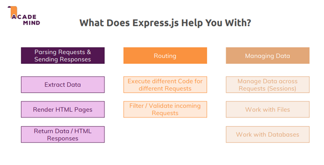
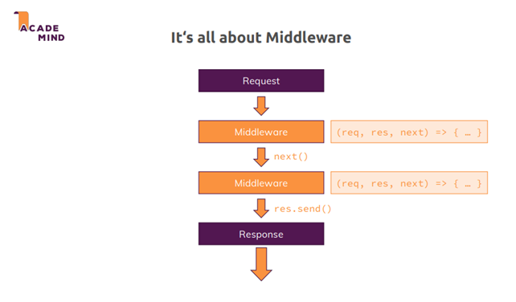
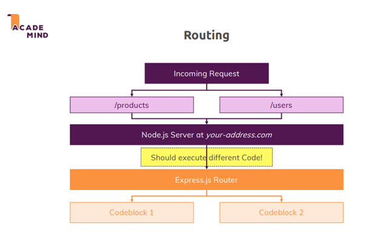
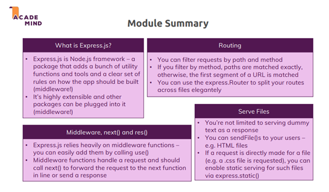

# 💬 Express.js

## 1. Introduction

Express.js is a powerful tool for creating Node.js applications, making it easier to handle requests, build APIs, and focus on application-specific logic.

<p align="center">
  
</p>

Express.js is not just a collection of helper functions but also:

- A toolkit: To work more efficiently.
- A set of rules: Guiding how to organize and work with the code to write clean code.

<p align="center">
  
</p>

## 2. Usage of Express.js

### Installation

```bash
npm install --save express
```

- Use `--save` instead of `--save-dev` because Express.js is a production dependency.

### Import & Use

```javascript
const http = require("http");

const express = require("express");

const app = express();

const sever = http.createServer(app);

server.listen(3000);
```

## 3. Middleware

### What is Middleware?

Middleware are functions executed sequentially as a request passes through the application. Middleware acts like "checkpoints" and helps perform tasks such as:

- **Pre-processing** requests.
- **Breaking complex logic** into reusable functions.
- **Integrating third-party features**.
- Handling **logging, authentication, and error management**.

<p align="center">
  
</p>

### Key Features

- Defined after initializing the app but before sending responses.
- Executed in the order defined in the source code.
- Registered using `app.use()`:

```javascript
app.use((req, res, next) => {
  // req: Request object
  // res: Response object
  // next: method to continue to the next middleware in line
});
```

### `next()` Method

- Passes the request to the next middleware.
- If `next()` is not called, the request is stuck.
- Example:

```javascript
app.use((req, res, next) => {
  console.log("First middleware");
  next(); // Passes control to the next middleware
});
```

## 4. Routing

<p align="center">
  
</p>

### Defining Routes

- Middleware can handle routes with `app.use()`:

```javascript
app.use("/path", middlewareFunction);
```

- Use `app.get()`, `app.post()` to restrict routes by HTTP method:

```javascript
app.get("/example", (req, res) => {
  res.send("GET request to /example");
});
```

### Order of Middleware

- Routes are processed in the order they are defined.
- More specific routes should come before general ones.

## 5. Handling POST Data

- Express doesn't parse POST request data by default.
- Use `body-parser` middleware:

```bash
npm install --save body-parser
```

```javascript
const bodyParser = require("body-parser");
app.use(bodyParser.urlencoded({ extended: true }));
```

- **`extended: false`**: Supports parsing simple data.
- **`extended: true`**: Allows parsing nested objects.

## 6. Express Router

- Break logic into smaller files using `express.Router()`.
- Example:

**File: `routes/admin.js`**

```javascript
const express = require("express");
const router = express.Router();

router.get("/add-product", (req, res) => {
  res.send("Add Product Page");
});

module.exports = router;
```

**File: `app.js`**

```javascript
const adminRoutes = require("./routes/admin");
app.use("/admin", adminRoutes);
```

- Benefits:
  - Keeps `app.js` clean.
  - Modular structure simplifies maintenance.

---

## 7. Handling 404 Errors

- Add a catch-all middleware at the end:

```javascript
app.use((req, res) => {
  res.status(404).send("Page Not Found");
});
```

## 8. Serving Static Files

- Store static files (CSS, JS, images) in a `public` folder.
- Serve them using `express.static`:

```javascript
app.use(express.static("public"));
```

- Example:
  - Place `style.css` in `public/css/style.css`.
  - Access it via `/css/style.css`.

## 9. Sending HTML Files

- Use `res.sendFile()` to send HTML files:

```javascript
const path = require("path");
app.get("/", (req, res) => {
  res.sendFile(path.join(__dirname, "views", "index.html"));
});
```

- Ensure paths are constructed using `path.join()` for compatibility.

---

## 10. Optimizing Paths

- Use `require.main.filename` and `path.dirname()` to get the root directory:

**File: `util/path.js`**

```javascript
const path = require("path");
module.exports = path.dirname(require.main.filename);
```

- Example usage:

```javascript
const rootDir = require("./util/path");
const path = require("path");
app.get("/", (req, res) => {
  res.sendFile(path.join(rootDir, "views", "index.html"));
});
```

## 11. Summary

- Express.js simplifies building web applications with features like middleware, routing, and modular structures.
- Proper organization and use of tools like `body-parser`, `express.static`, and `express.Router()` ensure efficient development.

<p align="center">
  
</p>
