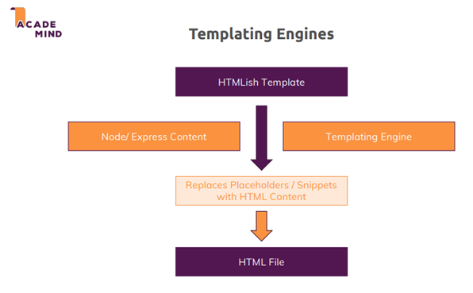

# 1. Templating Engines in Node.js

Templating engines are used to embed dynamic content into HTML pages. They replace placeholders in HTML-like templates with real data from the server to generate fully rendered HTML sent to users.

## How It Works

- Templates contain HTML structure and placeholders for dynamic content.
- Data from the Node.js app is injected into the templates.
- The templating engine processes placeholders and generates the final HTML.

<p align="center">
  
</p>

## Popular Templating Engines

1. **EJS (Embedded JavaScript)**  
   Uses normal HTML with placeholders like `<% %>` or `<%= %>`.

   - Supports plain JavaScript (e.g., `if` statements, loops).
   - Flexible and easy to use.

2. **Pug (formerly Jade)**  
   Features minimal HTML with a custom syntax (e.g., `#{}` for dynamic content).

   - Reduces verbosity of HTML.
   - Built-in support for control flow and iterations.

3. **Handlebars**  
   Uses normal HTML with placeholders like `{{ }}`.
   - Simpler and less feature-rich than EJS.
   - Follows a custom template language.

<p align="center">
  
</p>

## Comparison

- **EJS**: Full HTML syntax, powerful with JavaScript integration.
- **Pug**: Minimalistic, uses its own syntax. Suitable for compact code but less beginner-friendly.
- **Handlebars**: HTML-based, simpler but more restrictive compared to EJS.

<p align="center">
  
</p>

## Install

```bash
npm install --save ejs pug express-handlebars
```

# 2. Pug

## Configuring Templating Engines
```javascript
app.set("view engine", "pug"); // Use Pug as the default engine
app.set("views", "views"); // 'views' is the default directory
```

