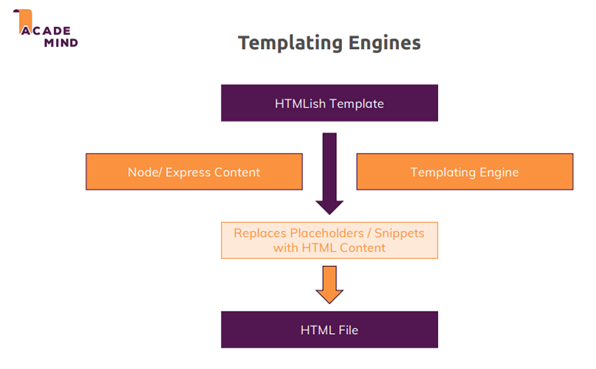
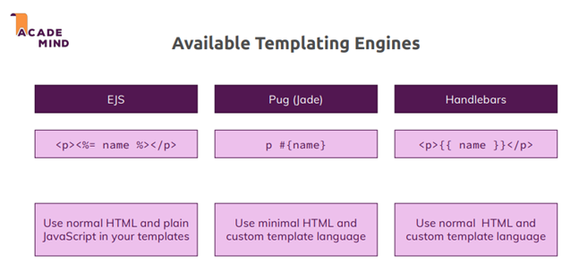

# 1. Templating Engines in Node.js

Templating engines are used to embed dynamic content into HTML pages. They replace placeholders in HTML-like templates with real data from the server to generate fully rendered HTML sent to users.

## How It Works

- Templates contain HTML structure and placeholders for dynamic content.
- Data from the Node.js app is injected into the templates.
- The templating engine processes placeholders and generates the final HTML.

<p align="center">
  
</p>

## Popular Templating Engines

1. **EJS (Embedded JavaScript)**  
   Uses normal HTML with placeholders like `<% %>` or `<%= %>`.

   - Supports plain JavaScript (e.g., `if` statements, loops).
   - Flexible and easy to use.

2. **Pug (formerly Jade)**  
   Features minimal HTML with a custom syntax (e.g., `#{}` for dynamic content).

   - Reduces verbosity of HTML.
   - Built-in support for control flow and iterations.

3. **Handlebars**  
   Uses normal HTML with placeholders like `{{ }}`.
   - Simpler and less feature-rich than EJS.
   - Follows a custom template language.

<p align="center">
  
</p>

## Comparison

- **EJS**: Full HTML syntax, powerful with JavaScript integration.
- **Pug**: Minimalistic, uses its own syntax. Suitable for compact code but less beginner-friendly.
- **Handlebars**: HTML-based, simpler but more restrictive compared to EJS.

<p align="center">
  
</p>

## Install

```bash
npm install --save ejs pug express-handlebars
```

# 2. Pug

### Configuring Templating Engines

```javascript
app.set("view engine", "pug"); // Use Pug as the default engine
app.set("views", "views"); // 'views' is the default directory
```

### Creating a Pug Template

Templates are stored in the `views` directory by default.

- **Syntax**: Uses indentation instead of angle brackets and closing tags.
- **Attributes**: Write attributes in parentheses after the tag.
- **Nesting**: Indentation defines parent-child relationships.

Example of a `shop.pug` file:

```pug
doctype html
html(lang="en")
  head
    meta(charset="UTF-8")
    meta(name="viewport", content="width=device-width, initial-scale=1.0")
    title My shop
    link(rel="stylesheet", href="/css/main.css")
    link(rel="stylesheet", href="/css/product.css")
  body
    header.main-header
      nav.main-header_nav
        ul.main-header__item-list
          li.main-header__item
            a.active(href="/") Shop
          li.main-header__item
            a.active(href="/admin/add-product") Add Product
```

### Rendering a Template

To render a Pug template in your routes, in `routes/shop.js`:

```javascript
router.get("/", (req, res, next) => {
  const products = adminData.products;
  res.render("shop", { products, pageTitle: "Shop" });
});
```

### Dynamic Content

- **Variables**: Insert dynamic content with `#{}`.
- **Conditionals**: Use `if` for conditional rendering.
- **Loops**: Use `each` to loop through an array.

Example of updated `shop.pug` file:

```pug
main
  if products.length > 0
    div.grid
    each product in products
      article.card.product-item
        header.card__header
          h1.product__title #{product.title}
        div.card__image
          img(src="https://cdn.pixabay.com/photo/2016/03/31/20/51/book-1296045_960_720.png", alt="A Book")
        div.card__content
          h2.product__price $19.99
          p.product__description A very interesting book about so many even more interesting things!
        div.card__actions
          button.btn Add to Cart
  else
    h2 No products found.
```

### Creating Layouts

To avoid repetition and make code more maintainable, you can create a **layout** in Pug that is shared across multiple views. Here's how to create and use layouts effectively:

#### 1. Define the Layout Structure

Create a new layout file (e.g., `main-layout.pug`) in a `layouts` folder. This file will contain the common structure shared by all pages, such as the header, meta tags, and external CSS links.

```pug
doctype html
html(lang="en")
  head
    meta(charset="UTF-8")
    meta(name="viewport" content="width=device-width, initial-scale=1.0")
    meta(http-equiv="X-UA-Compatible" content="ie=edge")
    title #{pageTitle}
    link(rel="stylesheet" href="/css/main.css")
    block styles
  body
    header.main-header
      nav.main-header__nav
        ul.main-header__item-list
          li.main-header__item
            a(href="/" class=(path === "/" ? "active" : "")) Shop
          li.main-header__item
            a(href="/admin/add-product" class=(path === "/admin/add-product" ? "active" : "")) Add Product
    block content
```

- `block styles:` This block allows you to insert custom styles from other views.
- `block content:` This block will be filled with the page-specific content from the child views.

#### 2. Extend the Layout in Child Views

In `views/shop.pug`

- Use the `extends` keyword to link to the main layout file and define the content that will be injected into the layout's blocks.

- Use **`block`**: Define placeholders that can be filled with custom content or styles in individual pages.

Example for `shop.pug`

```pug
extends layouts/main-layout.pug

block styles
  link(rel="stylesheet" href="/css/product.css")

block content
  main
    if products.length > 0
      div.grid
      each product in products
        article.card.product-item
          header.card__header
            h1.product__title #{product.title}
          div.card__image
            img(src="https://cdn.pixabay.com/photo/2016/03/31/20/51/book-1296045_960_720.png", alt="A Book")
          div.card__content
            h2.product__price $19.99
            p.product__description A very interesting book about so many even more interesting things!
          div.card__actions
            button.btn Add to Cart
    else
      h2 No products found.
```
