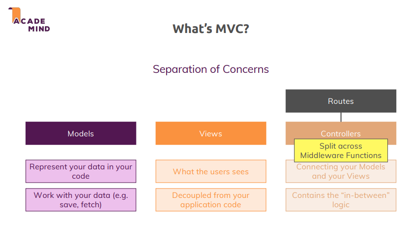

# Understanding MVC (Model-View-Controller)

## What is MVC?
MVC is a design pattern that emphasizes **separation of concerns**, ensuring that different parts of your code are responsible for different tasks. It stands for:

- **Model**
- **View**
- **Controller**

This pattern makes your application more maintainable, testable, and scalable by clearly defining the roles of each part.

  

## Components of MVC

### **Model**
- Represents **data** in your application.
- Responsible for:
  - **Saving** data.
  - **Fetching** data from storage (e.g., files, databases, or in-memory).
- Does not concern itself with how data is displayed or interacted with by the user.

### **View**
- Responsible for the **user interface (UI)**.
- Handles what the user sees, such as rendering HTML content.
- Decoupled from application logic.
- Integrates data injected from controllers to dynamically generate content via templating engines.

### **Controller**
- Acts as the **middleman** between Models and Views.
- Responsible for:
  - Handling **application logic**.
  - Fetching or saving data using the Model.
  - Passing data to Views for rendering.
- Orchestrates how the data is processed and displayed.

## How Routes Fit In
- Routes define:
  - **Path**: The URL endpoint.
  - **HTTP method**: (e.g., `GET`, `POST`).
  - **Controller action**: The specific logic to execute.
- Controllers then:
  - Decide which Model to interact with.
  - Determine which View to render.

## MVC with Express
- Express applications naturally support the MVC pattern through its **middleware** system.
- Controllers often split logic across middleware functions for better modularity.

## Benefits of MVC
- **Clear separation** of concerns.
- Easier to maintain and test.
- Promotes reusable components.
