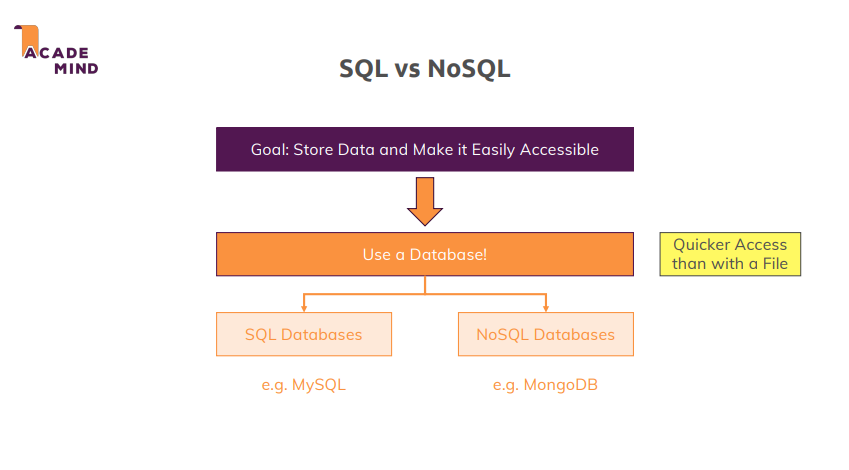
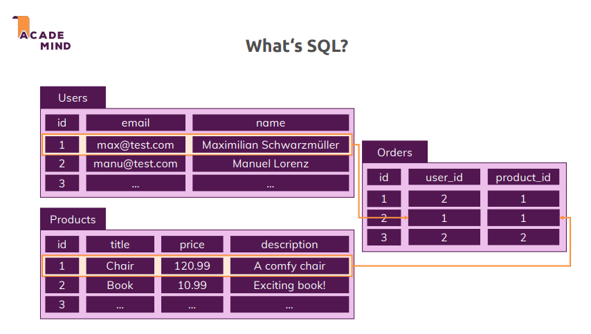
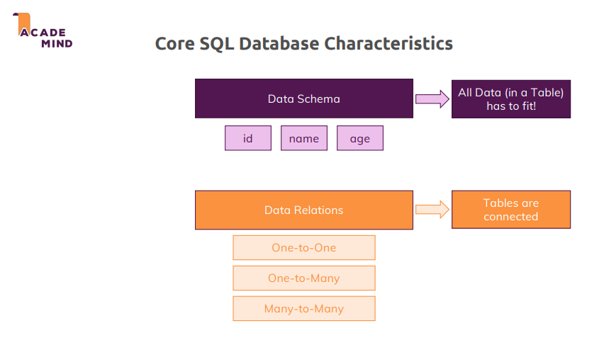
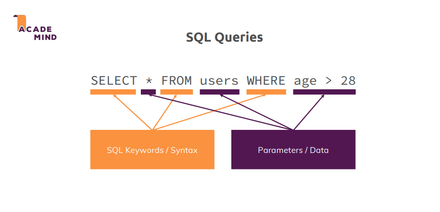
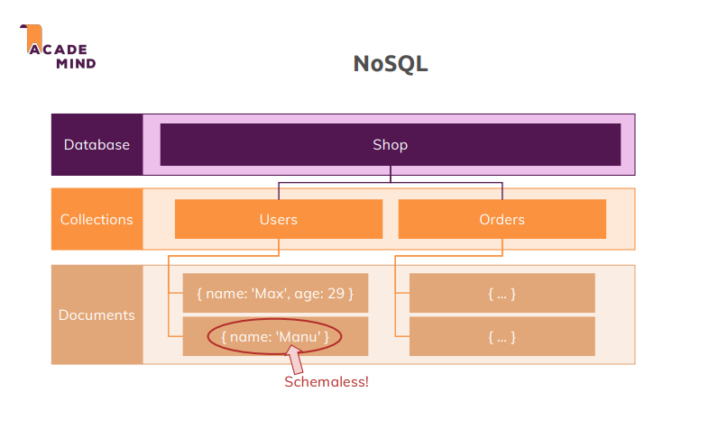
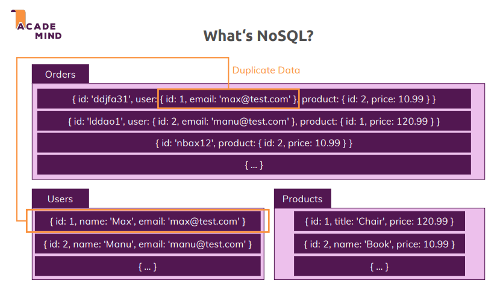
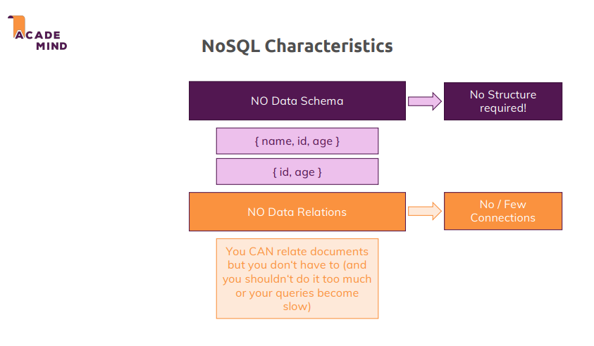
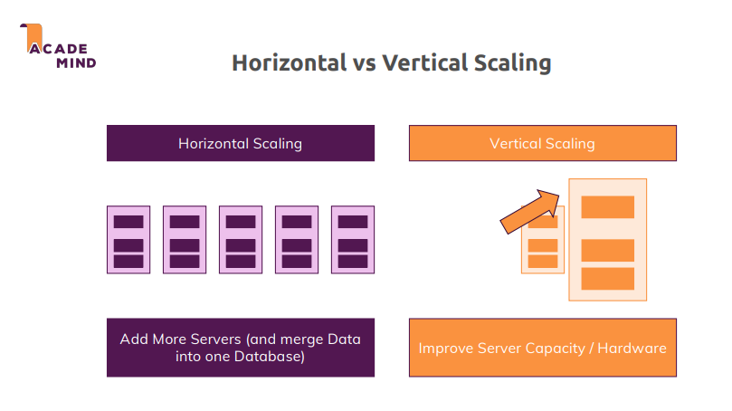
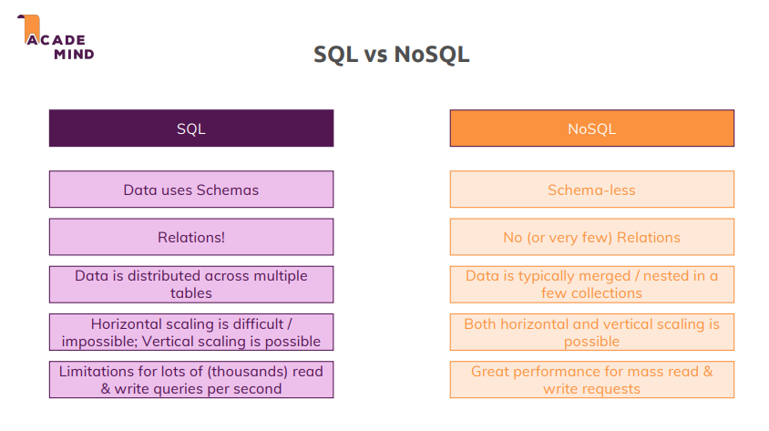

# SQL vs NoSQL: Key Differences and Concepts

## Why Use Databases?

**Purpose**: Store and efficiently access data, especially as it grows.

**Advantages over files**:

- Faster access to specific pieces of data.
- Avoid reading an entire file for one piece of information.

<p align="center">
  
</p>

## SQL (Structured Query Language)

### Core Characteristics:

1. **Table-based structure**:

- Data is stored in tables, each with fields (columns) and records (rows).
- Example tables: `Users`, `Products`, `Orders`.

<p align="center">
  
</p>

1. **Strong Data Schema**:

- Clearly defined schema for each table.
- Specifies field types: number, string, boolean, etc.
- Data must conform to the schema.

3. **Data Relations**:

- Tables are connected via relationships:
  - **One-to-One**: Each record in Table A relates to one record in Table B.
  - **One-to-Many**: One record in Table A relates to multiple records in Table B.
  - **Many-to-Many**: Multiple records in Table A relate to multiple records in Table B.
- Example: `Orders` table connects users and products.

<p align="center">
  
</p>

1. **Query Language**:

- Uses structured commands (queries) to interact with data.
- Example: `SELECT * FROM Users WHERE age > 28;`

<p align="center">
  
</p>

## NoSQL Databases

### Core Characteristics:

1. **Collections and Documents**:

- Equivalent to tables and records in SQL.
- Collections contain **documents**, which are similar to JavaScript objects.
- Example of documents in a `Users` collection:

  ```json
  { "name": "John", "age": 30 }
  { "name": "Manuel" }
  ```

- **No strict schema**:
  - Documents in the same collection can have different structures.
  - Fields are flexible and not strictly defined.

<p align="center">
  
</p>

2. **No Data Relations**:

- **Duplicate Data**: Data is often copied between collections instead of being related via IDs.
- Example:
  `Orders` collection includes nested user details instead of referencing a `Users` document.
- **Advantages**:
  - Faster data retrieval without joining multiple tables.
  - Simplifies queries for applications requiring quick access to data.
- **Disadvantages**:
  - Updates to duplicated data must be done in multiple places.

<p align="center">
  
</p>

1. **Performance and Scalability**:

- Focus on speed and efficiency for large-scale applications.
- **No Joins**:
  - Simplified retrieval of data without cross-collection queries.
- **Scalability**:
  - NoSQL databases are typically easier to scale horizontally (adding more servers).

<p align="center">
  
</p>

# SQL vs. NoSQL: Comparison

## Scaling Approaches:

1. **Horizontal Scaling**:

- **Definition**: Adding more servers to distribute the data.
- **Advantages**:
  - Virtually unlimited scaling by adding servers.
- **Challenges**:
  - Requires intelligent query processing to manage distributed data.
- **SQL**:
  - Horizontal scaling is **difficult or nearly impossible** due to the complexity of managing relations.
- **NoSQL**:
  - Horizontal scaling is **easier** and supported by many cloud providers.
  - Often better for applications with high read/write throughput.

2. **Vertical Scaling**:

- **Definition**: Upgrading the existing server with more CPU, memory, or other resources.
- **Advantages**:
  - Simple and quick to implement, especially with cloud providers.
- **Limitations**:
  - Limited by the maximum capacity of a single server.
- **SQL**:
  - Vertical scaling is **easily possible**.
- **NoSQL**:
  - Can also utilize vertical scaling but focuses more on horizontal scalability.

<p align="center">
  
</p>

## Core Characteristics:

### SQL:

- **Schema**:
- Strong, predefined schema.
- Data structure is strictly enforced.
- **Relations**:
- Data is split across multiple tables and connected through relationships.
- **Best Use Case**:
- Applications with complex, highly relational data.
- Scenarios requiring strong consistency and structured data.

### NoSQL:

- **Schema**:
- Schemaless, flexible structure.
- Mixed data structures within the same collection are allowed.
- **Relations**:
- Minimal to no relations; data is often duplicated for efficiency.
- **Best Use Case**:
- Applications needing high performance for frequent read/write operations.
- Scenarios where data structure varies or changes frequently.

<p align="center">
  
</p>

## Performance:

1. **SQL**:

- Great for structured data with strong consistency requirements.
- May struggle with high-throughput applications due to complex joins.

2. **NoSQL**:

- Excels in high-performance scenarios with large-scale data.
- Optimized for fast read/write without joins.

## Choosing Between SQL and NoSQL:

**SQL**:
- Ideal for applications requiring strong data consistency, complex relationships, and well-structured data.
- Examples: Banking systems, enterprise resource planning (ERP), and customer relationship management (CRM).

**NoSQL**:
- Best suited for applications needing flexibility, scalability, and high throughput.
- Examples: Real-time analytics, e-commerce platforms, and social media feeds.


## Practical Application:

- Some applications can benefit from **both SQL and NoSQL**:
- SQL for managing structured and less frequently changing data (e.g., user profiles).
- NoSQL for dynamic, high-frequency operations (e.g., shopping carts or orders).
