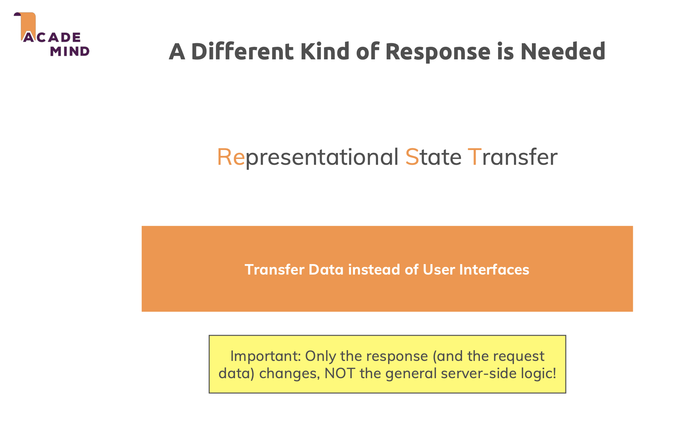
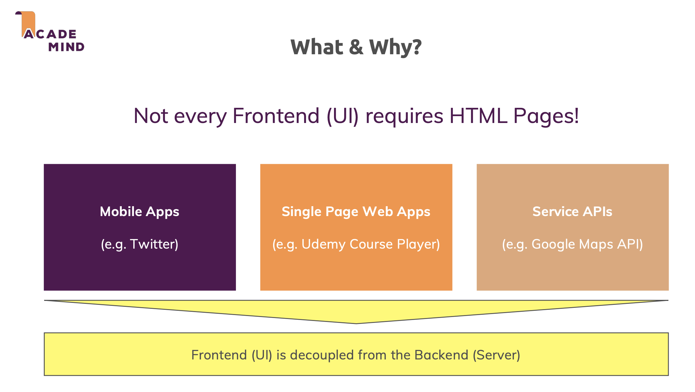
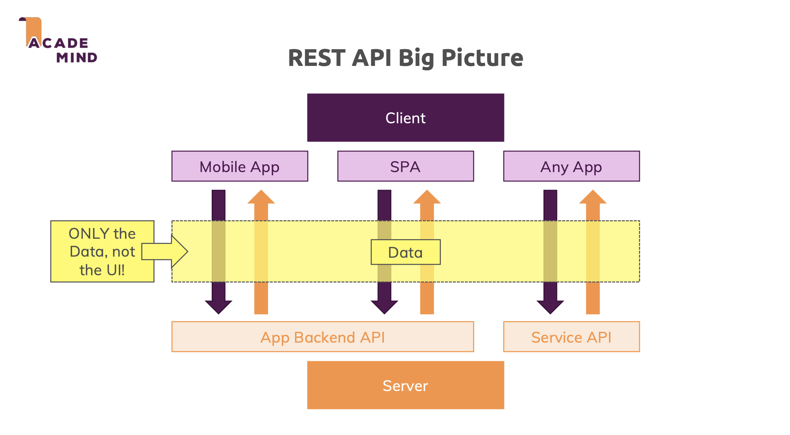
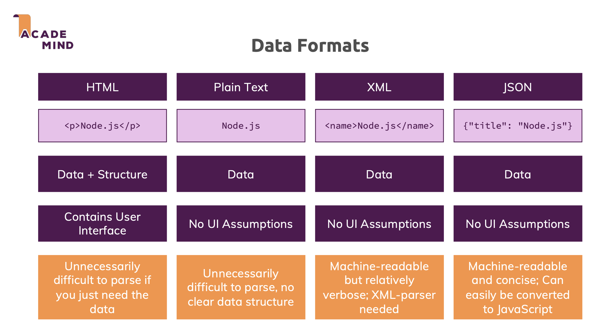
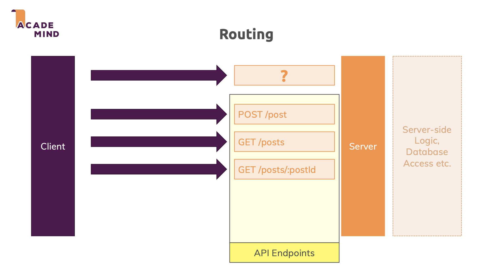
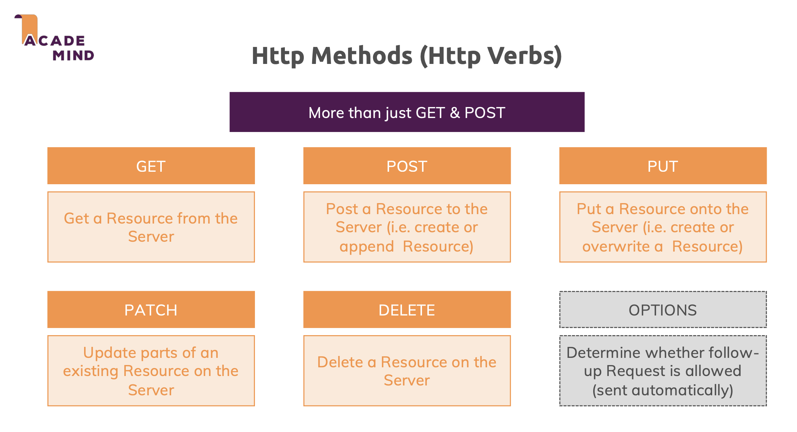
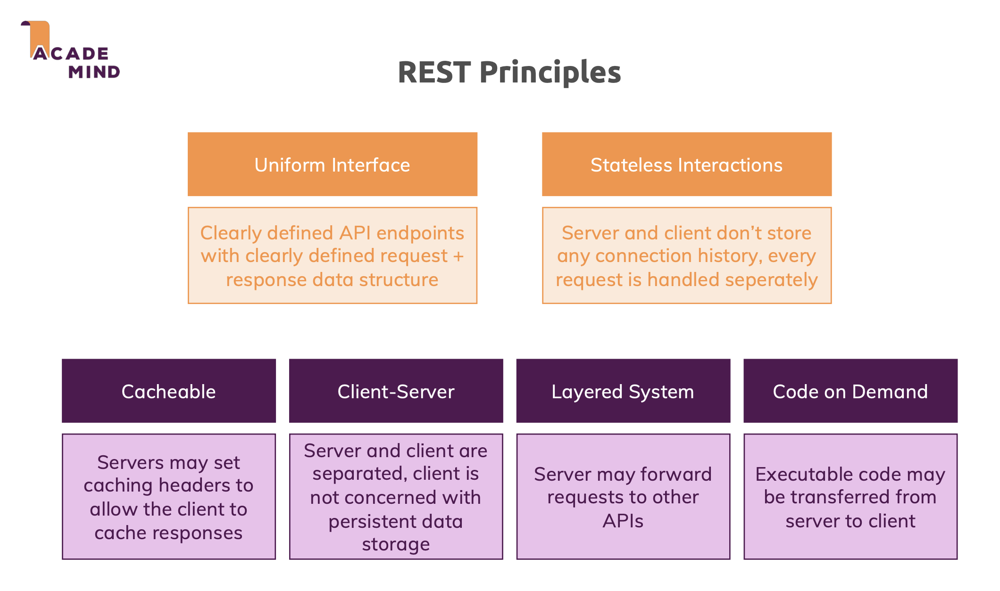
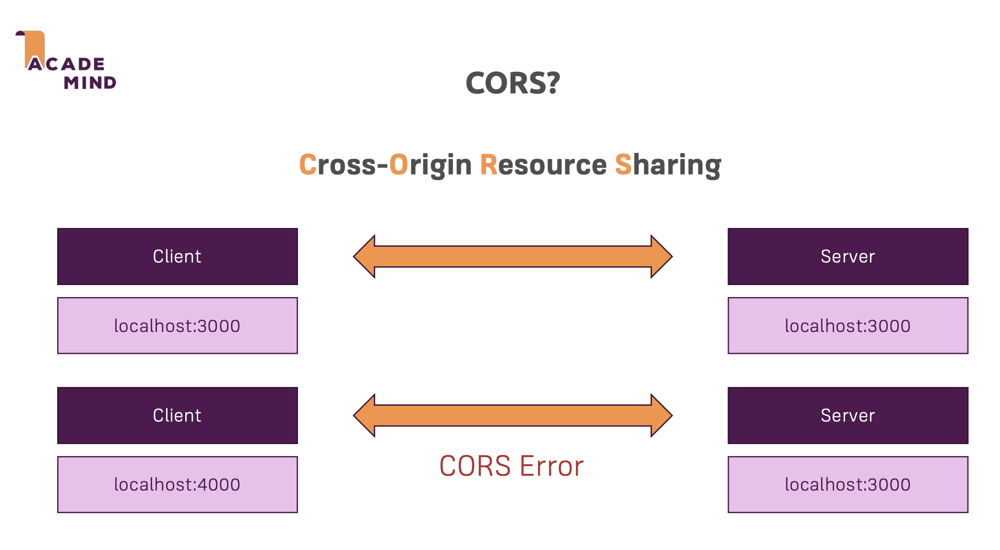

# 1. What is REST API?

## What is REST API?

REST (Representational State Transfer) is an architectural style for designing networked applications. Simply put, REST APIs transfer data between client and server instead of user interfaces.

<p align="center">
  
</p>

## When to use?

- Frontend doesn't need server-rendered HTML
- Need decoupled frontend and backend
- Data exchange is prioritized over UI delivery

## Common Use Cases

1. **Mobile Applications**

   - Built with native languages (Java/Swift)
   - Use platform-specific UI components
   - Only need raw data to display

2. **Single Page Applications (SPA)**

   - Example: Udemy player
   - JavaScript handles DOM
   - No page refreshes needed
   - Smooth user experience

3. **Third-party API Integration**
   - Example: Google Maps API
   - Pure data exchange
   - Backend services integration

<p align="center">
  
</p>

## Key Benefits

- Decoupled architecture
- Frontend technology flexibility
- Enhanced user experience
- Reusable backend services
- Better scalability

# 2. Accessing Data with REST API

## How REST API Works

- Client (mobile/web app) communicates with server through API
- One API can serve multiple clients (web, mobile, etc.)
- Same data can be presented differently on each client
- Frontend handles the UI presentation

<p align="center">
  
</p>

## Data Exchange Format

Common formats for data transfer:

1. **HTML**

   - Contains both data and structure
   - Includes UI elements
   - Difficult to parse for data-only needs
   - Not suitable for REST APIs

2. **Plain Text**

   - Contains only data
   - No structure
   - Hard for machines to parse
   - Not recommended for APIs

3. **XML**

   - Custom tags for data structure
   - No UI assumptions
   - Machine-readable
   - Requires special parser
   - More verbose

4. **JSON (Preferred Format)**
   - Data-only format
   - No UI assumptions
   - Easy machine readability
   - Simple JavaScript conversion
   - Concise structure
   - Most widely used in modern APIs

<p align="center">
  
</p>

## Why JSON?

- Lightweight data format
- Native JavaScript support
- Easy to read and write
- No unnecessary overhead
- Universal client support

# 3. Understanding Routing & HTTP Methods

## Client-Server Communication

- Requests sent from client to server
- Each request combines HTTP method and path
- Server defines endpoints (method + path combinations)
- Server executes logic when request reaches endpoint

<p align="center">
  
</p>

## HTTP Methods

1. **GET**

   - Retrieve resource from server
   - Read-only operation
   - Default browser method

2. **POST**

   - Create new resource
   - Append to existing resources
   - Never overwrites

3. **PUT**

   - Create or overwrite resource
   - Complete resource update

4. **PATCH**

   - Partial resource update
   - Modify specific fields

5. **DELETE**

   - Remove resource from server

6. **OPTIONS**
   - Browser automatic request
   - Checks request permissions
   - Used for CORS

## Important Notes

- Server logic isn't restricted by HTTP method
- Methods suggest intended operation
- Following REST conventions is best practice
- Makes API behavior predictable
- Methods indicate developer's intentions

<p align="center">
  
</p>

# 4. Core REST Principles

## Key Principles

### 1. Uniform Interface

- Clearly defined API endpoints (HTTP method + path)
- Well-documented request/response structures
- Predictable behavior
- Consistent interface
- API should be self-descriptive

### 2. Stateless Interactions

- Server and client are completely separated
- No connection history stored
- No sessions used
- Each request treated independently
- Server doesn't track client state

<p align="center">
  
</p>

## Additional Principles

### Cacheable

- Responses can be cached
- Server defines cache validity
- Improves performance

### Client-Server Separation

- Clear separation of concerns
- Client doesn't handle data storage
- Server manages persistence
- Independent evolution

### Layered System

- Client unaware of intermediary servers
- Request may be handled by multiple servers
- Supports system scalability

### Code on Demand (Optional)

- Server can transfer executable code
- Client can execute received code
- Rarely used in practice

# 5. Understanding CORS

## What is CORS?

- Cross-Origin Resource Sharing
- Security mechanism in web browsers
- Restricts cross-origin HTTP requests
- Prevents unauthorized access to resources

## When CORS Errors Occur

- Frontend and backend on different domains
- Different ports count as different origins
- Browser blocks requests by default
- Only affects browser-based clients
- Mobile apps don't face CORS issues

<p align="center">
  
</p>

## Solving CORS Issues

**Set CORS headers in middleware**

```javascript
app.use((req, res, next) => {
  res.setHeader("Access-Control-Allow-Origin", "*");
  res.setHeader(
    "Access-Control-Allow-Methods",
    "GET, POST, PUT, PATCH, DELETE, OPTIONS"
  );
  res.setHeader("Access-Control-Allow-Headers", "Content-Type, Authorization");
  next();
});
```
