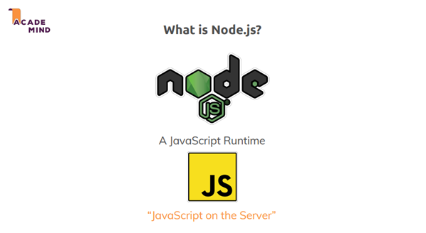
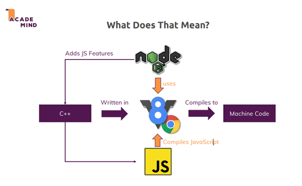
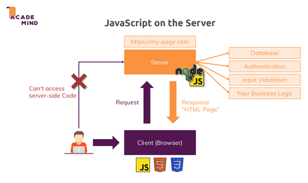
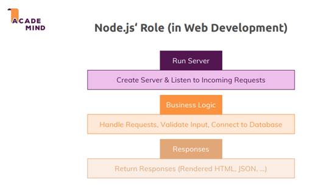
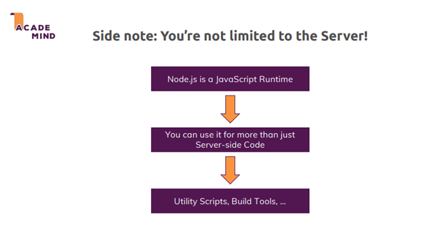

# 💬 Introduction

## What is Node.js?

Node.js is a JavaScript runtime that allows JavaScript to run on servers, powered by the V8 engine. It enables the execution of JavaScript code outside the browser, providing capabilities like file operations, network connections, and server creation.

  

## How Node.js Works

- **V8 Engine**: Compiles JavaScript code into machine code for optimized execution.
- **Node.js Features**: Handles file operations, network connections, and server logic, extending the V8 engine with additional APIs.

  

## Why Do We Need Node.js on the Server?

Node.js enables server-side tasks such as:

- **Database connections**: Securely managing data.
- **User authentication**: Protecting sensitive operations.
- **Input validation**: Ensuring safe data exchange.
- **Business logic**: Performing complex operations.

  

Node.js handles both the request-response cycle and server creation without external dependencies, using an asynchronous event-driven model.

  

## Other Roles of Node.js

Besides server-side applications, Node.js is used for:

- **Build tools**: Supporting frameworks like React, Angular, and Vue.
- **Automation**: Running utility scripts for deployment, testing, and file operations.

  

